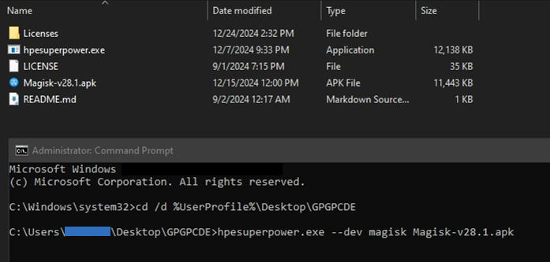
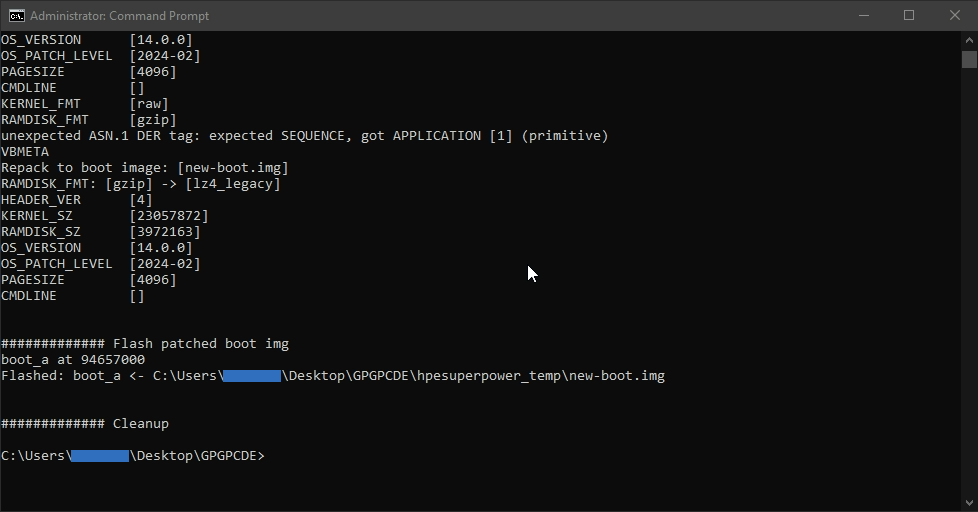

# Magisk on GPGPCDE: Method 2

Install Magisk on GPGPCDE (Google Play Games on PC Developer Emulator).

ㅤ
## Table of Contents

- [Minimum System Requirements](#minimum-system-requirements)
- [Installation](#installation)  
  - [Requirements](#1-requirements)  
  - [Google Play Games on PC Developer Emulator (GPGPCDE)](#2-google-play-games-on-pc-developer-emulator-gpgpcde)  
  - [Aow Tools](#3-aow-tools)  
  - [Magisk](#4-magisk)  
  - [Create Folder](#5-create-folder)  
  - [Root with `hpesuperpower`](#6-root-with-hpesuperpower)
- [Install Apps](#install-apps)  
  - [AdAway](#adaway)  
  - [Aurora Store](#aurora-store)  
  - [Other Apps](#other-apps)
- [Others](#others)  
  - [GPGPCDE Navigation](#gpgpcde-navigation)  
  - [Screenshot](#screenshot)
- [Credits](#credits)

ㅤ
## Minimum system requirements

- **OS**: Windows 10 (v2004)
- **Storage**: Solid state drive (SSD) with 10 GB of available storage space
- **Graphics**: IntelⓇ UHD Graphics 630 GPU or comparable
- **Processor**: 4 CPU physical cores (some games require an Intel CPU)
- **Memory**: 8 GB of RAM
- Windows admin account
- Hardware virtualization must be turned on:
  - [Enable virtualization](https://support.microsoft.com/en-us/windows/enable-virtualization-on-windows-c5578302-6e43-4b4b-a449-8ced115f58e1)
  - [Enable Hyper-V](https://learn.microsoft.com/en-us/virtualization/hyper-v-on-windows/quick-start/enable-hyper-v)

**Note**: more about these requirements, [read here](https://support.google.com/googleplay?p=eligibility_requirements).

ㅤ
## Installation

### 1. Requirements

- [Google Play Games on PC Developer Emulator](https://developer.android.com/games/playgames/emulator) (GPGPCDE)
- [Aow Tools](https://apps.microsoft.com/detail/9nxm6552h2ql?hl=en-US) (Free Trial)
- [hpesuperpower](https://github.com/chsbuffer/hpesuperpower?tab=readme-ov-file)
- [Magisk](https://github.com/topjohnwu/Magisk?tab=readme-ov-file)
- [7-Zip](https://7-zip.org/)

ㅤ
### 2. Google Play Games on PC Developer Emulator (GPGPCDE)

1. Download & install **GPGPCDE** (Stable Edition).
2. Open **GPGPCDE** and login with your Google account.
3. Allow `USB debugging`, check `Always allow from this computer`, then click `Allow`.

ㅤ  
**Note**: 
- When you **sign out**, your local **device files**, including **any apps/games** you have installed, will be <ins>**erased**</ins>.
- If the **GPGPCDE** page display is blank (sleep), use:
  - **PgDn** keys <kbd>↓</kbd>
  - **Click & swipe up**
  - **Scroll with mouse** (PC mode).
- [Navigation (keyboard shortcuts)](#gpgpcde-navigation)

ㅤ
### 3. Aow Tools

1. Install **Aow Tools** by clicking the **Free Trial** button.  
  Don’t worry, this app supports <ins>unlimited trials without limitations</ins>.  
  You can **support** the developer by purchasing the app.
2. Open **Aow Tools** and click the `⚙ Settings` menu in the left navigation bar.
    - `Adb Config` section > `Adb.exe Current Path` > `Select Adb.exe`
    - Paste the following path into the address bar in File Explorer:  
    `C:\Program Files\Google\Play Games Developer Emulator\current\emulator`
    - Add `adb.exe` file.
3. Open **Aow Tools** and click the `? Help` menu in the left navigation bar.
4. Look at the `Remove local loopback restrictions` section, use the first method with **CMD** (as administrator).
5. Click the `Device` menu. **GPGPCDE** device (`vsoc_kiwi_x86_64`) will be visible and show `Online` status.

ㅤ
### 4. Magisk

1. Download the **Magisk** app.
2. Open **Aow Tools** > `Install` > You can drag and drop APK files to install Android apps.
3. Install **Magisk**.
4. Open **GPGPCDE**, You will see **Magisk** installed in the app drawer.

ㅤ
### 5. Create folder

1. Open **File Explorer**.
2. Go to **Desktop** or `%UserProfile%\Desktop`.
3. Create a new folder "**GPGPCDE**".

ㅤ
### 6. Root with `hpesuperpower`

1. In the **taskbar notification area** or **system tray icon**, right-click **GPGPCDE** icon and click `Exit`.
2. Download & extract **hpesuperpower** to `%UserProfile%\Desktop\GPGPCDE` folder.
3. Move the `Magisk-vXX.XX.apk` file to `%UserProfile%\Desktop\GPGPCDE` folder.
4. Open **CMD** as administrator
5. Navigate to the **GPGPCDE** folder, type `cd /d %UserProfile%\Desktop\GPGPCDE` > **Enter**
6. Root **GPGPCDE** with the command `hpesuperpower.exe --dev magisk <magisk_apk_file>` > **Enter**
    - e.g.: `hpesuperpower.exe --dev magisk Magisk-v28.1.apk`
    - More about **hpesuperpower** Command Line , [read here](https://github.com/chsbuffer/hpesuperpower/releases/tag/1.1.0).

      
7. Wait until the root process is complete.

    
8. Reopen **GPGPCDE**.
9. Open **Magisk** > You will be prompted with `Requires Additional Setup` > `OK`.
10. Wait until **GPGPCDE** finishes rebooting.

ㅤ
## Install apps

### AdAway

1. Open **Magisk** > `⚙` Settings (top right corner) > `Magisk` section > click `Systemless hosts`.
2. Close & exit **GPGPCDE** ([#11-1](#11-replace-with-patched-files)).
3. Reopen **GPGPCDE**.
4. Download and install [AdAway](https://github.com/AdAway/AdAway?tab=readme-ov-file) with **Aow Tools**.
5. Open **AdAway** > select `Root based ad blocking` > grant **root access** > `NEXT`.
6. Sync **AdAway** > `NEXT` > `FINISH`.

ㅤ
### Aurora Store

1. Download [Aurora Store](https://gitlab.com/AuroraOSS/AuroraStore) and install with **Aow Tools**
2. Open **Aurora Store** > setup : 
    - Grant permissions: 
      - `Installer Permission`
      - `External Storage Manager`
      - `Background Downloads`
      - `Notifications`
      - `App Links`
    - Click `Finish`
3. Click the **3 dots** in the top right corner :
    - `Spoof manager` > select `Device`, e.g.: `Samsung S20 Ultra` > `Restart`
    - `Settings` > `Installation` > `Installation method` > grant **root access** > select `Root installer`
    - `Settings` > `Updates` > `Auto-update apps` > `Do not auto-update apps`
4. Go back and Log in using `Anonymous`

ㅤ
### Other apps

- [Advanced Root Checker](https://play.google.com/store/apps/details?id=com.anu.developers3k.rootchecker)
- [Lawnchair](https://github.com/LawnchairLauncher/lawnchair?tab=readme-ov-file)
- [Shortcut Maker](https://play.google.com/store/apps/details?id=rk.android.app.shortcutmaker)
- [Soft Keys 2](https://github.com/dogusumit/SoftKeys2-HomeBackButton?tab=readme-ov-file) or [Back Button](https://play.google.com/store/apps/details?id=mavie.shadowsong.bb)
- [KillApps](https://play.google.com/store/apps/details?id=com.tafayor.killall)
- [ZArchiver](https://play.google.com/store/apps/details?id=ru.zdevs.zarchiver)
- [Magisk Modules Repo Loader (MMRL)](https://github.com/DerGoogler/MMRL?tab=readme-ov-file)
- [App Manager](https://github.com/MuntashirAkon/AppManager?tab=readme-ov-file)
- [DataBackup](https://github.com/XayahSuSuSu/Android-DataBackup?tab=readme-ov-file)
- [Termux](https://github.com/termux/termux-app?tab=readme-ov-file)
- [AFWall+](https://github.com/ukanth/afwall?tab=readme-ov-file)
- [Game Guardian](https://gameguardian.net/download) - [Bypass SDK enforcement](https://gameguardian.net/forum/topic/38963-game-guardian-android-14/)

ㅤ
## Others

### GPGPCDE Navigation

GPGPCDE keyboard shortcuts:
- <kbd>Ctrl</kbd> + <kbd>h</kbd>: press the home button
- <kbd>Ctrl</kbd> + <kbd>b</kbd> or <kbd>Esc</kbd>: press the back button
- <kbd>Ctrl</kbd> + <kbd>a</kbd>: open app drawer (home screen)
- <kbd>Ctrl</kbd> + <kbd>w</kbd>: open `Widgets` (home screen)
- <kbd>F11</kbd> or <kbd>Alt</kbd> + <kbd>Enter</kbd>: toggle between fullscreen and windowed mode
- <kbd>Shift</kbd> + <kbd>Tab</kbd>: open the Google Play Games on PC overlay, including the current key mappings for - the Input SDK

Note: <kbd>Ctrl</kbd> + <kbd>h</kbd> and <kbd>Ctrl</kbd> + <kbd>b</kbd> are provided for development purposes only. Don't rely on them in your shipping game.

### [Method: 1](../README.md)

ㅤ
## Credits

- [GPGPC Community](https://discord.gg/UYPSypWA8M)
- [hpesuperpower](https://github.com/chsbuffer/hpesuperpower?tab=readme-ov-file)
