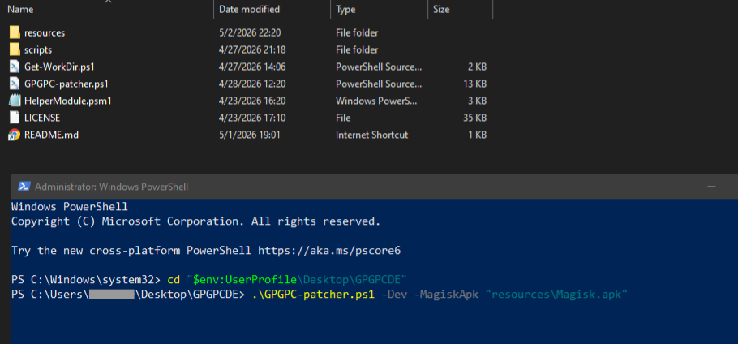
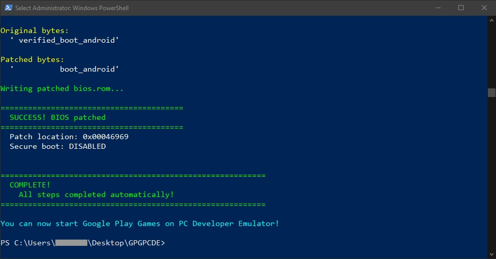

# Magisk on GPGPCDE: Method 3

<picture>![Badge Magisk]</picture>
<picture>![Badge GPGPC Dev]</picture>

Root Google Play Games on PC Developer Emulator (GPGPCDE) with Magisk.

<br/>

## Table of Contents

- [Minimum system requirements](#minimum-system-requirements)
- [Installation](#installation)
  - [1. Requirements](#1-requirements)
  - [2. GPGPCDE (Google Play Games on PC Developer Emulator)](#2-google-play-games-on-pc-developer-emulator-gpgpcde)
  - [3. Aow Tools](#3-aow-tools)
  - [4. Magisk](#4-magisk)
- [Patch](#patch)
  - [1. Create Folder](#1-create-folder)  
  - [2. Root with `GPGPC Patcher`](#2-root-with-gpgpc-patcher)
  - [3. Enable `Apps` on **Play Store** (optional)](#3-enable-apps-on-play-store-optional)
- [Install apps](#install-apps)
  - [AdAway](#adaway)
  - [Aurora Store](#aurora-store)
  - [Other apps](#other-apps)
- [Update GPGPCDE](#update-gpgpcde)
- [Others](#others)
  - [GPGPCDE: Release Notes](#gpgpcde-release-notes)
  - [GPGPCDE: Navigation](#gpgpcde-navigation)
  - [Method: 1](#method-1)
  - [Method: 2](#method-2)
- [Credits](#credits)
- [Disclaimer](#disclaimer)

<br/>

## Minimum system requirements

- **OS**: Windows 10 (v2004)
- **Storage**: Solid state drive (SSD) with available storage space:
  - **Installation**: 10 GB
  - **Games data**: 100 GB
- **Graphics**: IntelⓇ UHD Graphics 630 GPU or comparable
- **Processor**: 4 CPU physical cores (some games require an Intel CPU)
- **Memory**: 8 GB of RAM
- Windows admin account
- Hardware virtualization must be turned on:
  - [Enable virtualization](https://support.microsoft.com/en-us/windows/enable-virtualization-on-windows-c5578302-6e43-4b4b-a449-8ced115f58e1)
  - [Enable Hyper-V](https://learn.microsoft.com/en-us/virtualization/hyper-v-on-windows/quick-start/enable-hyper-v)
  - [Enable Hyper-V (CLI)](https://learn.microsoft.com/en-au/answers/questions/2083999/hyper-v-not-working#answer-1842490)

**Note**: more about these requirements, [read here](https://support.google.com/googleplay?p=eligibility_requirements).

<br/>

## Installation

### 1. Requirements

- [Google Play Games on PC Developer Emulator](https://developer.android.com/games/playgames/emulator) (GPGPCDE)
- [Aow Tools](https://apps.microsoft.com/detail/9nxm6552h2ql?hl=en-US) (Free Trial)
- [GPGPC Patcher](https://github.com/sekedus/GPGPCPatcher?tab=readme-ov-file)
- [Magisk](https://github.com/topjohnwu/Magisk?tab=readme-ov-file)

<br/>

### 2. GPGPCDE (Google Play Games on PC Developer Emulator)

1. Download & install **GPGPCDE** (Stable Edition).
2. Open **GPGPCDE** and login with your Google account.
3. Allow `USB debugging`, check `Always allow from this computer`, then click `Allow`.

<br/>
  
> [!NOTE]  
> - ⚠️ When you **sign out**, your local **device files**, including **any apps/games** you have installed, will be <ins>**erased**</ins>.
> - If the **GPGPCDE** page display is blank (sleep), use:
>   - **PgDn** keys <kbd>↓</kbd>
>   - **Click & swipe up**
>   - **Scroll with mouse** (PC mode).
> - [Navigation (keyboard shortcuts)](#gpgpcde-navigation)

<br/>

### 3. Aow Tools

1. Install **Aow Tools** by clicking the **Free Trial** button.  
   Don’t worry, this app supports <ins>unlimited trials without limitations</ins>.  
   You can **support** the developer by purchasing the app.
2. Open **Aow Tools** and click the `⚙ Settings` menu in the left navigation bar.

    - `Adb Config` section > `Adb.exe Current Path` > `Select Adb.exe`
    - Paste the following path into the address bar in File Explorer:  
      ```
      C:\Program Files\Google\Play Games Developer Emulator\current\emulator
      ```
    - Add `adb.exe` file.
3. Open **Aow Tools** and click the `? Help` menu in the left navigation bar.
4. Look at the `Remove local loopback restrictions` section, use the first method with **CMD** (as administrator).
5. Click the `Device` menu. **GPGPCDE** device (`vsoc_kiwi_x86_64`) will be visible and show `Online` status.

<br/>

### 4. Magisk

1. Download the **Magisk** app.
2. Open **Aow Tools** > `Install` > You can drag and drop APK files to install Android apps.
3. Install **Magisk**.
4. Open **GPGPCDE**, You will see **Magisk** installed in the app drawer.

<br/>

## Patch

### 1. Create folder

1. Open **File Explorer**.
2. Go to **Desktop** or `%UserProfile%\Desktop`.
3. Create a new folder "**GPGPCDE**".

<br/>

### 2. Root with `GPGPC Patcher`

1. [Completely exit][exit-gpgpc] **GPGPCDE** if it is running.
2. Download & extract <ins>GPGPC-Patcher</ins> to `%UserProfile%\Desktop\GPGPCDE` folder.
3. Ensure [all requirements](https://github.com/sekedus/GPGPCPatcher?tab=readme-ov-file#preparation) for <ins>GPGPC-Patcher</ins> have been met.  

   Beginner guide: [read here](https://www.google.com/search?udm=50&hl=en&q=beginner+guide%2C+step+by+step+to%3A%0A-+install+wsl2+%28ubuntu%29%0A-+setup+user+account+and+check+sudo%0A-+verify+installation+and+distributions%0A-+update+packages%0A-+install+packages%3A+bc+unzip+android-sdk-libsparse-utils+e2fsprogs%0A-+troubleshooting).

   (Optional) Temporarily disable sudo password prompt in WSL2: [read here](../TROUBLESHOOTING.md#temporarily-disable-sudo-password-prompt-wsl2)
4. Open **PowerShell** as administrator
5. Navigate to the **GPGPCDE** folder, type `cd "$env:UserProfile\Desktop\GPGPCDE"` > <kbd>Enter</kbd>
6. Root **GPGPCDE** with the command `.\GPGPC-patcher.ps1 -Dev -MagiskApk <magisk.apk>` > <kbd>Enter</kbd>

   For example:
   ```powershell
   .\GPGPC-patcher.ps1 -Dev -MagiskApk "resources\Magisk_30.7.apk"
   ```

   <br/>

   
7. Wait until the root process is complete.

    
8. Open **GPGPCDE**.
9. Open **Magisk** > You will be prompted with `Requires Additional Setup` > `OK`.
10. Wait until **GPGPCDE** finishes rebooting.
11. Reopen **GPGPCDE**.

<br/>

### 3. Enable `Apps` on **Play Store** (optional)

> [!CAUTION]  
> This method removes the [com.google.android.play.feature.HPE_EXPERIENCE](https://developer.android.com/games/playgames/pc-compatibility#detect-hpe) feature, causing the Play Store to recognize GPGPCDE as a regular Android mobile device.
>
> This approach has [several drawbacks](https://www.google.com/search?udm=50&hl=en&q=What+is+%22com.google.android.play.feature.HPE_EXPERIENCE%22+and+what+are+the+advantages+and+disadvantages+of+disabling+it+in+Google+Play+Games+on+PC+Developer+Emulator+%28GPGPCDE%29%3F) or potential problems:
>
> - Environment detection fails
> - PC-specific features are disabled
> - Compatibility risks
> - Emulator may crash randomly
> - Complete userdata wipe ([Issue #6](https://github.com/sekedus/MagiskOnGPGPCDE/issues/6))
> - And more...  
>
> 🚨 **USE AT YOUR OWN RISK!** 🚨

<br/>

1. Download Magisk Module [`GPGPC_Disable_HPE.zip`](../module/GPGPC_Disable_HPE.zip)
2. Open **Aow Tools** > `File` > `Download` folder > `↑ Upload` (bottom navigation bar).
3. Upload the `GPGPC_Disable_HPE.zip` file.
4. Open **GPGPCDE** > open **Magisk**.
5. Click the `Modules` menu in the bottom-right corner.
6. Click the `Install from storage` button.
7. Navigate to `Downloads` folder, double click the `GPGPC_Disable_HPE.zip` file.
8. You will be prompted with `Install Confirmation` > `OK`.
9. Wait for the `Done` message.
10. Click the `Reboot` button.
11. Wait until **GPGPCDE** finishes rebooting.
12. Reopen **GPGPCDE**.
13. Google Play Store **tweaks**:
    - **Stop auto update** Play Store: [read here](https://support.google.com/googleplay/thread/248186520?hl=en&msgid=248188080)
    - Turn off **Google Play Protect**: [read here](https://support.google.com/googleplay/answer/2812853?hl=en#:~:text=How%20to%20turn%20Google%20Play%20Protect%20on%20or%20off)
    - Turn off **app install optimization**: [read here](https://support.google.com/googleplay/answer/10122796?hl=en#:~:text=Turn%20app%20install%20optimization%20on%20or%20off)

<br/>

## Install apps

### AdAway

1. Open **Magisk** > `⚙` Settings (top right corner) > `Magisk` section > click `Systemless hosts`.
2. [Close & exit][exit-gpgpc] **GPGPCDE**.
3. Reopen **GPGPCDE**.
4. Download and install [AdAway](https://github.com/AdAway/AdAway?tab=readme-ov-file) with **Aow Tools**.
5. Open **AdAway** > select `Root based ad blocking` > grant **root access** > `NEXT`.
6. Sync **AdAway** > `NEXT` > `FINISH`.

<br/>

### Aurora Store

1. Download [Aurora Store](https://gitlab.com/AuroraOSS/AuroraStore) and install with **Aow Tools**
2. Open **Aurora Store** > setup : 
    - Grant permissions: 
      - `Installer Permission`
      - `External Storage Manager`
      - `Background Downloads`
      - `Notifications`
      - `App Links` - [supported links are grayed out](https://www.reddit.com/r/GrapheneOS/comments/16f7mg2/in_aurora_store_settings_playgooglecom_in_open/)
    - Click `Finish`
3. Click the **3 dots** in the top right corner :
    - `Spoof manager` > select `Device`, e.g.: `Samsung S20 Ultra` > `Restart`
    - `Settings` > `Installation` > `Installation method` > grant **root access** > select `Root installer`
    - `Settings` > `Updates` > `Auto-update apps` > `Do not auto-update apps`
4. Go back and Log in using `Anonymous`

<br/>

### Other apps

- [Advanced Root Checker](https://play.google.com/store/apps/details?id=com.anu.developers3k.rootchecker)
- [Lawnchair](https://github.com/LawnchairLauncher/lawnchair?tab=readme-ov-file)
- [Device Info HW](https://play.google.com/store/apps/details?id=ru.andr7e.deviceinfohw)
- [Shortcut Maker](https://play.google.com/store/apps/details?id=rk.android.app.shortcutmaker)
- [Soft Keys 2](https://github.com/dogusumit/SoftKeys2-HomeBackButton?tab=readme-ov-file) or [Back Button](https://apkcombo.com/back-button/mavie.shadowsong.bb/)
- [KillApps](https://play.google.com/store/apps/details?id=com.tafayor.killall)
- [ZArchiver](https://play.google.com/store/apps/details?id=ru.zdevs.zarchiver)
- [Amaze File Manager](https://github.com/TeamAmaze/AmazeFileManager?tab=readme-ov-file)
- [Fossify Gallery](https://github.com/FossifyOrg/Gallery?tab=readme-ov-file)
- [Magisk Modules Repo Loader (MMRL)](https://github.com/DerGoogler/MMRL?tab=readme-ov-file)
- [App Manager](https://github.com/MuntashirAkon/AppManager?tab=readme-ov-file)
- [DataBackup](https://github.com/XayahSuSuSu/Android-DataBackup?tab=readme-ov-file)
- [Termux](https://github.com/termux/termux-app?tab=readme-ov-file)
- [AFWall+](https://github.com/ukanth/afwall?tab=readme-ov-file)
- [Game Guardian](https://gameguardian.net/download) - [Bypass SDK enforcement](https://gameguardian.net/forum/topic/38963-game-guardian-android-14/)

<br/>

## Update GPGPCDE

Every time you update **GPGPCDE**, you must re-apply the patch.

1. In the **taskbar notification area** or **system tray icon**, right-click **GPGPCDE** icon and click `Check for updates`.
2. Click the `Check for update` button, if an update is available a `Download` button will appear.
3. Click `Download` and wait for update to complete and `Relaunch` button to appear.
4. Click `Relaunch`, if **GPGPCDE** is not running, launch it manually.
5. Re-root **GPGPCDE**, starting from **Patch** [#2](#2-root-with-hpesuperpower).
6. Open **GPGPCDE** > Open **Magisk**, validate root has been successful.
7. Close & exit **GPGPCDE**
8. Reopen **GPGPCDE**.

<br/>

## Others

### GPGPCDE: Release Notes

Read the current [release notes](https://support.google.com/googleplay?p=games_pc_release_notes).


### GPGPCDE: Navigation

GPGPCDE [keyboard shortcuts](https://developer.android.com/games/playgames/pg-emulator#navigation):
- <kbd>Ctrl</kbd> + <kbd>h</kbd>: press the home button
- <kbd>Ctrl</kbd> + <kbd>b</kbd> or <kbd>Esc</kbd>: press the back button
- <kbd>Ctrl</kbd> + <kbd>a</kbd>: open app drawer (home screen)
- <kbd>Ctrl</kbd> + <kbd>w</kbd>: open `Widgets` (home screen)
- <kbd>F11</kbd> or <kbd>Alt</kbd> + <kbd>Enter</kbd>: toggle between fullscreen and windowed mode
- <kbd>Shift</kbd> + <kbd>Tab</kbd>: open the Google Play Games on PC overlay, including the current key mappings for - the Input SDK

Note: <kbd>Ctrl</kbd> + <kbd>h</kbd> and <kbd>Ctrl</kbd> + <kbd>b</kbd> are provided for development purposes only. Don't rely on them in your shipping game.


### [Method: 1](../1/README.md)


### [Method: 2](../2/README.md)

<br/>

## Credits

- [GPGPC Patcher](https://github.com/sekedus/GPGPCPatcher?tab=readme-ov-file)

<br/>

## Disclaimer

This project is provided for **educational and research purposes only**.  

**USE AT YOUR OWN RISK!**

The authors and contributors are **not responsible for any damage, data loss, or legal issues** resulting from the use of this repository.


<!-- Url -->

[exit-gpgpc]: ../TROUBLESHOOTING.md#exit-google-play-games-on-pc

<!-- Badges -->

[Badge Magisk]: https://img.shields.io/badge/Magisk-v30.7-00AF9C.svg?logo=Magisk
[Badge GPGPC Dev]: https://img.shields.io/badge/Google%20Play%20Games%20on%20PC%20(Dev)-26.4.112.1-1A8039.svg?logo=data:image/svg%2bxml;base64,PD94bWwgdmVyc2lvbj0iMS4wIiBlbmNvZGluZz0idXRmLTgiPz48c3ZnIHhtbG5zPSJodHRwOi8vd3d3LnczLm9yZy8yMDAwL3N2ZyIgeG1sOnNwYWNlPSJwcmVzZXJ2ZSIgdmlld0JveD0iMCAwIDQ3OC42MzMgNTM0LjQ3OCI+PHBhdGggZmlsbD0iIzFBODAzOSIgZD0iTTAgNDc1LjIyVjU5LjIyOUMwIDEzLjcyNyA0OS4yODUtMTQuNzc2IDg4Ljc3NCA4LjAyN2wzNjAuMjggMjA3Ljk2OWMzOS40MzggMjIuODAzIDM5LjQzOCA3OS43MDUgMCAxMDIuNDU2TDg4Ljc3NCA1MjYuNDczQzQ5LjMzNiA1NDkuMjI0IDAgNTIwLjc3MyAwIDQ3NS4yMnoiLz48cGF0aCBmaWxsPSIjOTRGRUQ2IiBmaWxsLXJ1bGU9ImV2ZW5vZGQiIGQ9Ik0yNTcuOTggMjM2LjIwOGMtNy45ODEtNDYuNDg2LTQ4LjMtODAuMjc1LTk1LjQ2LTgwLjI3NUgwdjIyMi41ODRoMTE1LjU2N2w4NC4wMDcgODQuMDA3IDg5LjAzNC01MS40MDktMzAuNjI4LTE3NC45MDd6bS0xNDIuNjItNTAuMTY2YzE1LjM0IDAgMjcuODI5IDEyLjQ5IDI3LjgyOSAyNy45ODUgMCAxNS4zNC0xMi40OSAyNy44MjktMjcuODI5IDI3LjgyOS0xNS40OTUgMC0yNy45ODUtMTIuNDktMjcuOTg1LTI3LjgyOSAwLTE1LjQ5NSAxMi40OS0yNy45ODUgMjcuOTg1LTI3Ljk4NXpNNjIuMDg1IDI5NS4xODNjLTE1LjM0IDAtMjcuODI5LTEyLjQ5LTI3LjgyOS0yNy45ODUgMC0xNS4zNCAxMi40OS0yNy44MjkgMjcuODI5LTI3LjgyOSAxNS40OTUgMCAyNy45ODUgMTIuNDkgMjcuOTg1IDI3LjgyOSAwIDE1LjQ5Ni0xMi40OSAyNy45ODUtMjcuOTg1IDI3Ljk4NXptNTMuMjc1IDUzLjEyYy0xNS40OTUgMC0yNy45ODUtMTIuMzM0LTI3Ljk4NS0yNy44MjkgMC0xNS4zNCAxMi40OS0yNy44MjkgMjcuOTg1LTI3LjgyOSAxNS4zNCAwIDI3LjgyOSAxMi40OSAyNy44MjkgMjcuODI5LjAwMSAxNS40OTUtMTIuNDg5IDI3LjgyOS0yNy44MjkgMjcuODI5em01My44NDUtNTMuMTJjLTE1LjQ5NSAwLTI3Ljk4NS0xMi40OS0yNy45ODUtMjcuOTg1IDAtMTUuMzQgMTIuNDktMjcuODI5IDI3Ljk4NS0yNy44MjkgMTUuMzQgMCAyNy44MjkgMTIuNDkgMjcuODI5IDI3LjgyOS0uMDUxIDE1LjQ5Ni0xMi41NDEgMjcuOTg1LTI3LjgyOSAyNy45ODV6IiBjbGlwLXJ1bGU9ImV2ZW5vZGQiLz48L3N2Zz4=
