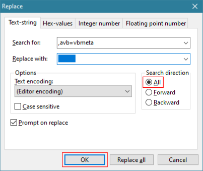
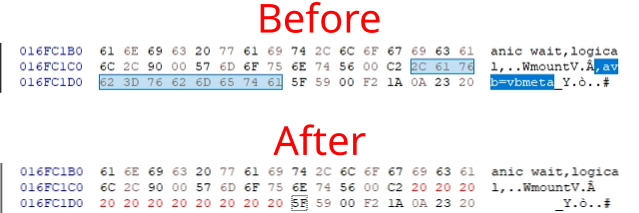
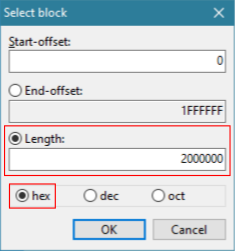
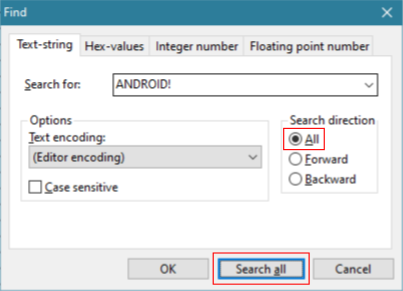
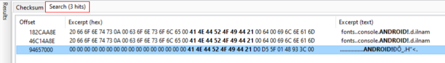
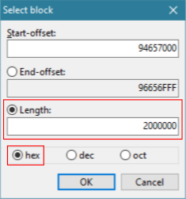
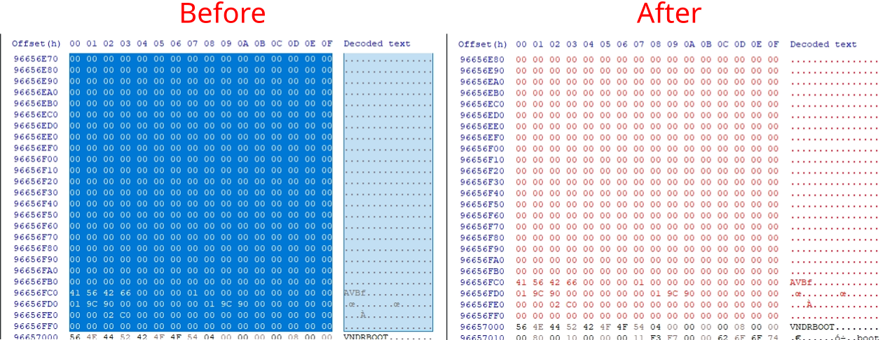
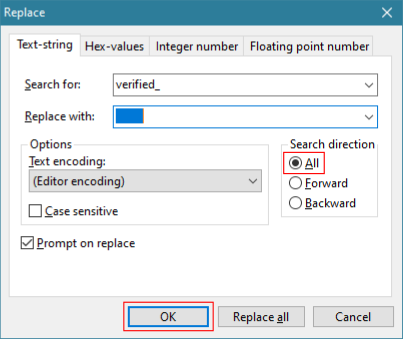
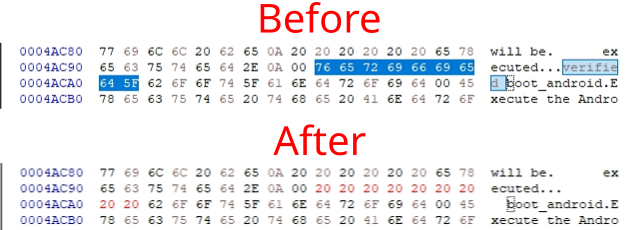

# Magisk on GPGPC Developer Emulator

Install Magisk on GPGPCDE (Google Play Games on PC Developer Emulator).

> This repository was created based on a comment in the [XDA Forums t-4486817#post-89464596](https://xdaforums.com/t/4486817/post-89464596).

ㅤ
## Table of Contents

- [Minimum system requirements](#minimum-system-requirements)
- [Installation](#installation)
  - [1. Requirements](#1-requirements)
  - [2. Google Play Games on PC Developer Emulator (GPGPCDE)](#2-google-play-games-on-pc-developer-emulator-gpgpcde)
  - [3. Aow Tools](#3-aow-tools)
  - [4. Magisk](#4-magisk)
  - [5. Create folder](#5-create-folder)
  - [6. Copy/backup `aggregate.img` & `bios.rom`](#6-copybackup-aggregateimg--biosrom)
  - [7. Patch `1.boot_a.img`](#7-patch-1boot_aimg)
  - [8. Edit `magisk_patched-xxxxx_xxxxx.img`](#8-edit-magisk_patched-xxxxx_xxxxximg)
  - [9. Add patched boot image to `aggregate.img`](#9-add-patched-boot-image-to-aggregateimg)
  - [10. Edit `bios.rom`](#10-edit-biosrom)
  - [11. Replace with patched files](#11-replace-with-patched-files)
- [Install apps](#install-apps)
  - [AdAway](#adaway)
  - [Aurora Store](#aurora-store)
  - [Other apps](#other-apps)
- [Others](#others)
  - [GPGPCDE Navigation](#gpgpcde-navigation)
  - [Screenshot](#screenshot)
  - [Method: 2](#method-2)
- [Credits](#credits)

ㅤ
## Minimum system requirements

- **OS**: Windows 10 (v2004)
- **Storage**: Solid state drive (SSD) with 10 GB of available storage space
- **Graphics**: IntelⓇ UHD Graphics 630 GPU or comparable
- **Processor**: 4 CPU physical cores (some games require an Intel CPU)
- **Memory**: 8 GB of RAM
- Windows admin account
- Hardware virtualization must be turned on:
  - [Enable virtualization](https://support.microsoft.com/en-us/windows/enable-virtualization-on-windows-c5578302-6e43-4b4b-a449-8ced115f58e1)
  - [Enable Hyper-V](https://learn.microsoft.com/en-us/virtualization/hyper-v-on-windows/quick-start/enable-hyper-v)

**Note**: more about these requirements, [read here](https://support.google.com/googleplay?p=eligibility_requirements).

ㅤ
## Installation

### 1. Requirements

- [Google Play Games on PC Developer Emulator](https://developer.android.com/games/playgames/emulator) (GPGPCDE)
- [Aow Tools](https://apps.microsoft.com/detail/9nxm6552h2ql?hl=en-US) (Free Trial)
- [HxD Portable](https://mh-nexus.de/en/downloads.php?product=HxD20)
- [Magisk](https://github.com/topjohnwu/Magisk?tab=readme-ov-file)
- [7-Zip](https://7-zip.org/)

ㅤ
### 2. Google Play Games on PC Developer Emulator (GPGPCDE)

1. Download & install **GPGPCDE** (Stable Edition).
2. Open **GPGPCDE** and login with your Google account.
3. Allow `USB debugging`, check `Always allow from this computer`, then click `Allow`.

ㅤ  
**Note**: 
- When you **sign out**, your local **device files**, including **any apps/games** you have installed, will be <ins>**erased**</ins>.
- If the **GPGPCDE** page display is blank (sleep), use:
  - **PgDn** keys <kbd>↓</kbd>
  - **Click & swipe up**
  - **Scroll with mouse** (PC mode).
- [Navigation (keyboard shortcuts)](#gpgpcde-navigation)

ㅤ
### 3. Aow Tools

1. Install **Aow Tools** by clicking the **Free Trial** button.  
  Don’t worry, this app supports <ins>unlimited trials without limitations</ins>.  
  You can **support** the developer by purchasing the app.
2. Open **Aow Tools** and click the `⚙ Settings` menu in the left navigation bar.
    - `Adb Config` section > `Adb.exe Current Path` > `Select Adb.exe`
    - Paste the following path into the address bar in File Explorer:  
    `C:\Program Files\Google\Play Games Developer Emulator\current\emulator`
    - Add `adb.exe` file.
3. Open **Aow Tools** and click the `? Help` menu in the left navigation bar.
4. Look at the `Remove local loopback restrictions` section, use the first method with **CMD** (as administrator).
5. Click the `Device` menu. **GPGPCDE** device (`vsoc_kiwi_x86_64`) will be visible and show `Online` status.

ㅤ
### 4. Magisk

1. Download the **Magisk** app.
2. Open **Aow Tools** > `Install` > You can drag and drop APK files to install Android apps.
3. Install **Magisk**.
4. Open **GPGPCDE**, You will see **Magisk** installed in the app drawer.

ㅤ
### 5. Create folder

1. Open **File Explorer**.
2. Go to **Desktop** or `%UserProfile%\Desktop`.
3. Create a new folder "**GPGPCDE**".

ㅤ
### 6. Copy/backup `aggregate.img` & `bios.rom`

1. Go to `C:\Program Files\Google\Play Games Developer Emulator\current\emulator\avd`
2. Copy/backup the `aggregate.img` & `bios.rom` file to `%UserProfile%\Desktop\GPGPCDE` folder.
3. Open the `aggregate.img` file with **7-Zip** and extract the `1.boot_a.img` file.

ㅤ
### 7. Patch `1.boot_a.img`

1. Open **Aow Tools** > `File` > `Download` folder > click `↑ Upload` (bottom navigation bar).
2. Upload the `1.boot_a.img` file.
3. Open **GPGPCDE** > open **Magisk**.
4. Click the `Install` button in the **Magisk card**
5. Choose `Select and Patch a File` in method, double click the `1.boot_a.img` file.
6. Click `LET'S GO` and wait for the `All done!` message.
7. Go back to **Aow Tools** > `File` > `Download` folder
8. Select the `magisk_patched-xxxxx_xxxxx.img` file and click `↓ Download`
9. Save to `%UserProfile%\Desktop\GPGPCDE`

ㅤ
### 8. Edit `magisk_patched-xxxxx_xxxxx.img`

1. Download & extract **HxD Portable**.
2. Open the `magisk_patched-xxxxx_xxxxx.img` file with **HxD**.
3. Open replace box (<kbd>Ctrl</kbd>+<kbd>r</kbd>) > `Text-string` section :
    - **Search for**: `,avb=vbmeta`
    - **Replace with**: "&#160;&#160;&#160;&#160;&#160;&#160;&#160;&#160;&#160;&#160;&#160;" (without quotation marks) `11`
    - **Search direction**: `All`
    - Select `Prompt on replace` (optional)
    - Click `OK`

      

      
4. Select **all** the hex bytes of the file (<kbd>Ctrl</kbd>+<kbd>a</kbd>), then right-click and select `Select block...` (<kbd>Ctrl</kbd>+<kbd>e</kbd>).
5. Check the `Length` section and copy the value.

    

ㅤ
### 9. Add patched boot image to `aggregate.img`

1. Open the `aggregate.img` file with **HxD**.
2. Open search box (<kbd>Ctrl</kbd>+<kbd>f</kbd>) > `Text-string` section :
    - **Search for**: `ANDROID!`
    - **Search direction**: `All`
    - Click `Search all`

      
3. In the `Result` section > `Search ({N} hits)` > double click the last match.

    
4. Right-click on the selected text, then select `Select block...` :
    - Check the `Length` section and fill it with the **length** of file `magisk_patched-xxxxx_xxxxx.img` ([#8-5](#8-edit-magisk_patched-xxxxx_xxxxximg)).
    - Click `OK`

      
5. Go back to `magisk_patched-xxxxx_xxxxx.img` file, then copy all the hex bytes of the file ([#8-4](#8-edit-magisk_patched-xxxxx_xxxxximg)).
6. Replace the **selected text** in the `aggregate.img` file with the copied bytes.

    
7. **Save**.

ㅤ
### 10. Edit `bios.rom`

1. Open the `bios.rom` file with **HxD**.
2. Open replace box (<kbd>Ctrl</kbd>+<kbd>r</kbd>) > `Text-string` section :
    - **Search for**: `verified_`
    - **Replace with**: "&#160;&#160;&#160;&#160;&#160;&#160;&#160;&#160;&#160;" (without quotation marks) `9`
    - **Search direction**: `All`
    - Click `OK`

      

      
3. **Save**.

ㅤ
### 11. Replace with patched files

1. In the **taskbar notification area** or **system tray icon**, right-click **GPGPCDE** icon and click `Exit`.
2. Copy & paste patched files (`aggregate.img` & `bios.rom`) to `C:\Program Files\Google\Play Games Developer Emulator\current\emulator\avd`.
3. Reopen **GPGPCDE**.
4. Open **Magisk** > You will be prompted with `Requires Additional Setup` > `OK`.
5. Wait until **GPGPCDE** finishes rebooting.

ㅤ
## Install apps

### AdAway

1. Open **Magisk** > `⚙` Settings (top right corner) > `Magisk` section > click `Systemless hosts`.
2. Close & exit **GPGPCDE** ([#11-1](#11-replace-with-patched-files)).
3. Reopen **GPGPCDE**.
4. Download and install [AdAway](https://github.com/AdAway/AdAway?tab=readme-ov-file) with **Aow Tools**.
5. Open **AdAway** > select `Root based ad blocking` > grant **root access** > `NEXT`.
6. Sync **AdAway** > `NEXT` > `FINISH`.

ㅤ
### Aurora Store

1. Download [Aurora Store v4.4.4 (58)](https://gitlab.com/AuroraOSS/AuroraStore/-/releases/4.4.4) and install with **Aow Tools**
2. Open **Aurora Store** > setup : 
    - Installer: `Root installer` > grant **root access**
    - Permissions: Grant `Background Downloads`, `External Storage Manager`, and `Notifications`
    - Click `Finish`
3. Click the **3 dots** in the top right corner :
    - `Spoof manager` > select `Device`, e.g.: `Samsung S9+`
    - `Settings` > `Installation` > `Installation method` > grant **root access** > select `Root installer`
    - `Settings` > `Updates` > `Auto-update apps` > `Do not auto-update apps`
4. Go back and Log in using `Anonymous`

ㅤ
### Other apps

- [Advanced Root Checker](https://play.google.com/store/apps/details?id=com.anu.developers3k.rootchecker)
- [Lawnchair](https://github.com/LawnchairLauncher/lawnchair?tab=readme-ov-file)
- [Shortcut Maker](https://play.google.com/store/apps/details?id=rk.android.app.shortcutmaker)
- [Soft Keys 2](https://github.com/dogusumit/SoftKeys2-HomeBackButton?tab=readme-ov-file) or [Back Button](https://play.google.com/store/apps/details?id=mavie.shadowsong.bb)
- [KillApps](https://play.google.com/store/apps/details?id=com.tafayor.killall)
- [ZArchiver](https://play.google.com/store/apps/details?id=ru.zdevs.zarchiver)
- [Amaze File Manager](https://github.com/TeamAmaze/AmazeFileManager?tab=readme-ov-file)
- [Fossify Gallery](https://github.com/FossifyOrg/Gallery?tab=readme-ov-file)
- [Magisk Modules Repo Loader (MMRL)](https://github.com/DerGoogler/MMRL?tab=readme-ov-file)
- [App Manager](https://github.com/MuntashirAkon/AppManager?tab=readme-ov-file)
- [DataBackup](https://github.com/XayahSuSuSu/Android-DataBackup?tab=readme-ov-file)
- [Termux](https://github.com/termux/termux-app?tab=readme-ov-file)
- [AFWall+](https://github.com/ukanth/afwall?tab=readme-ov-file)
- [Game Guardian](https://gameguardian.net/download) - [Bypass SDK enforcement](https://gameguardian.net/forum/topic/38963-game-guardian-android-14/)

ㅤ
## Others

### GPGPCDE Navigation

GPGPCDE keyboard shortcuts:
- <kbd>Ctrl</kbd> + <kbd>h</kbd>: press the home button
- <kbd>Ctrl</kbd> + <kbd>b</kbd> or <kbd>Esc</kbd>: press the back button
- <kbd>Ctrl</kbd> + <kbd>a</kbd>: open app drawer (home screen)
- <kbd>Ctrl</kbd> + <kbd>w</kbd>: open `Widgets` (home screen)
- <kbd>F11</kbd> or <kbd>Alt</kbd> + <kbd>Enter</kbd>: toggle between fullscreen and windowed mode
- <kbd>Shift</kbd> + <kbd>Tab</kbd>: open the Google Play Games on PC overlay, including the current key mappings for - the Input SDK

Note: <kbd>Ctrl</kbd> + <kbd>h</kbd> and <kbd>Ctrl</kbd> + <kbd>b</kbd> are provided for development purposes only. Don't rely on them in your shipping game.

### [Screenshot](./screenshot/README.md)

### [Method: 2](./2/README.md)

ㅤ
## Credits

- [XDA Forums t-4486817#post-89464596](https://xdaforums.com/t/4486817/post-89464596)
- [XDA Forums t-4656397](https://xdaforums.com/t/4656397/)
- [XDA Sideloading apps on GPGPCDE](https://www.xda-developers.com/sideload-apps-on-google-play-games-emulator/)
- [kilObit 7496373535076556798](https://kil0bit.blogspot.com/2023/11/google-launched-official-android.html)
- [Phandroid p-339416](https://phandroid.com/?p=339416)
