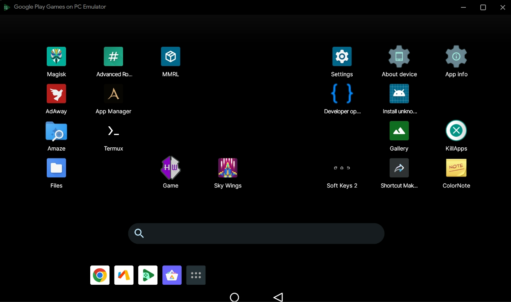
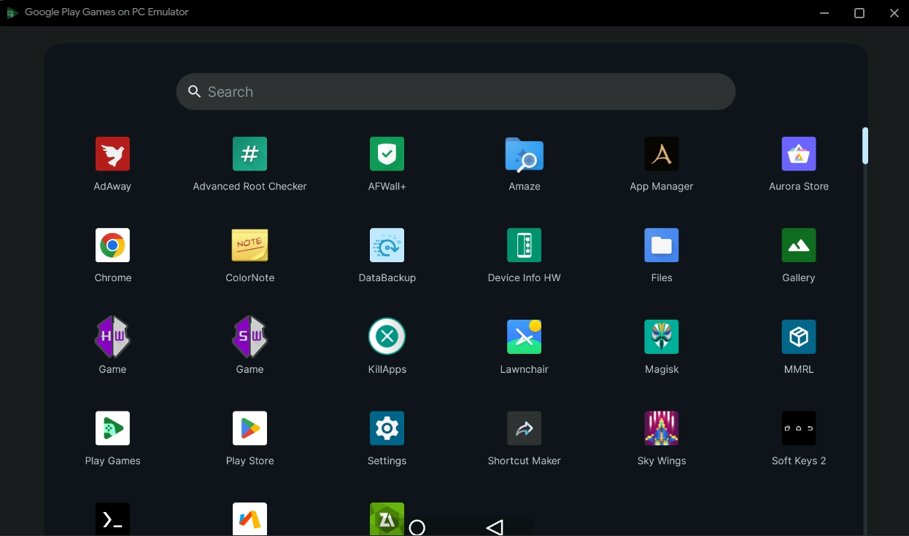
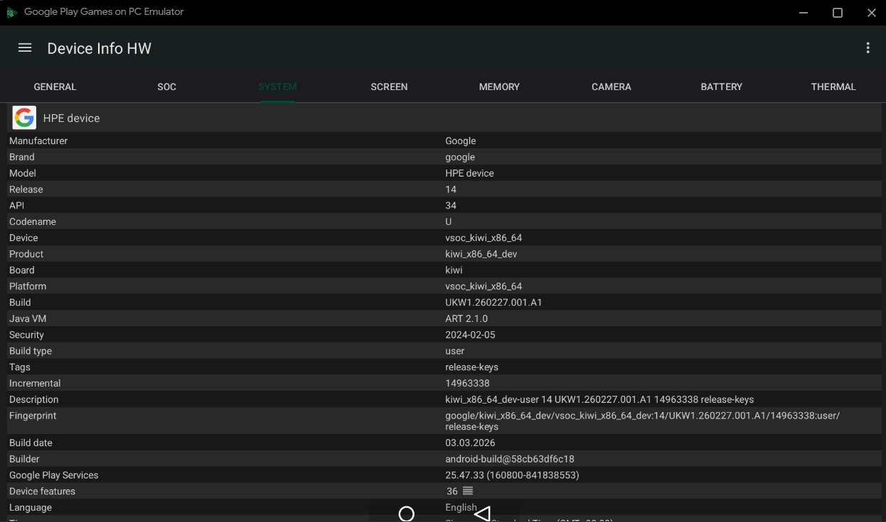
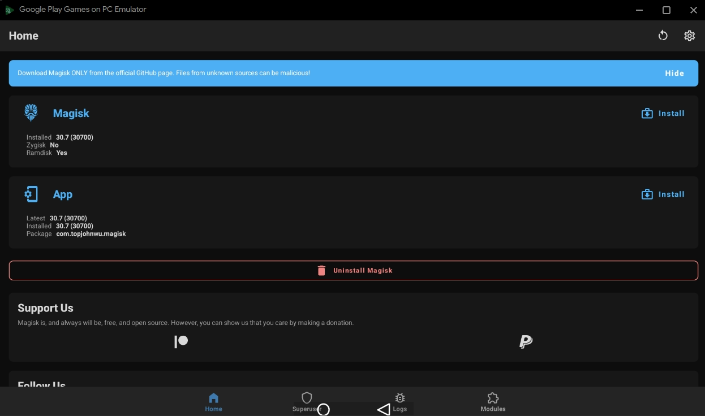
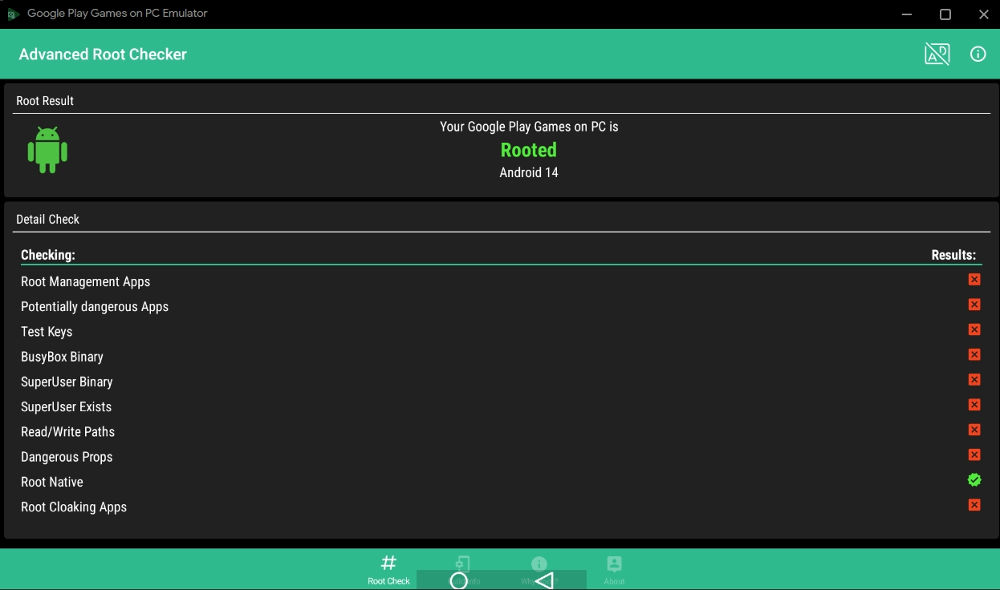
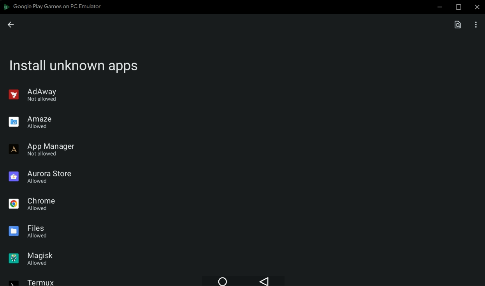
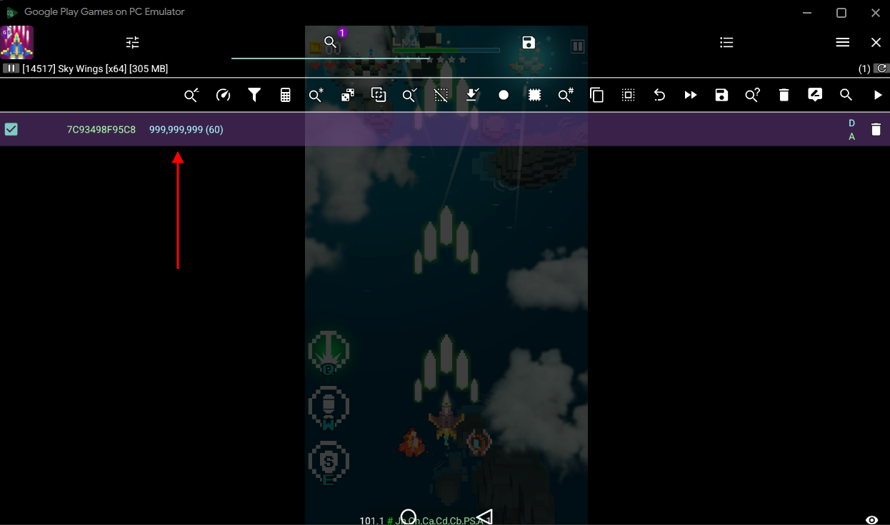
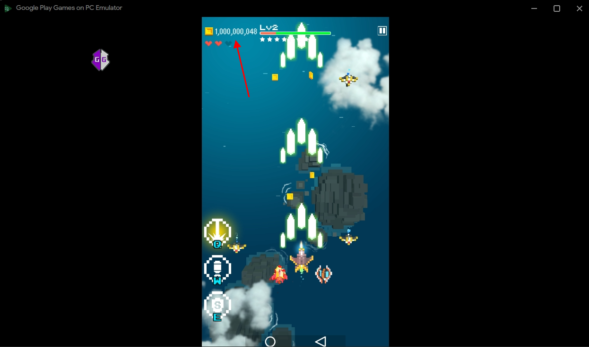
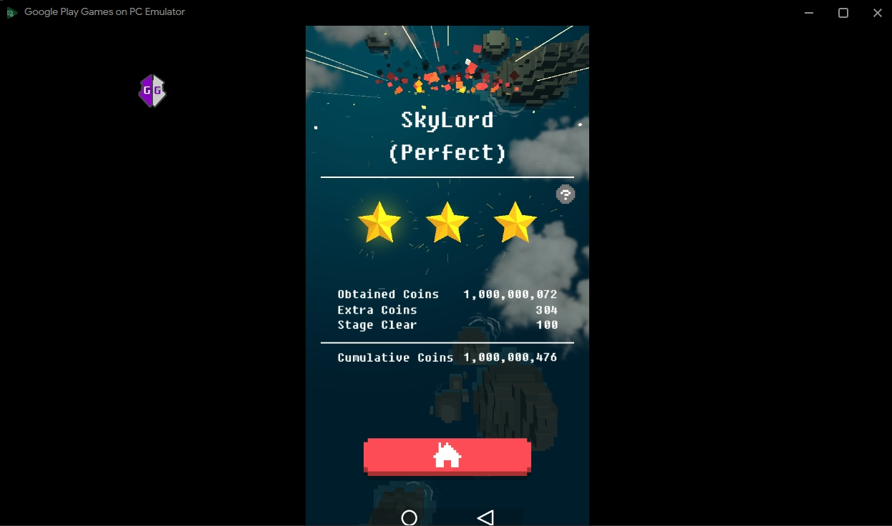
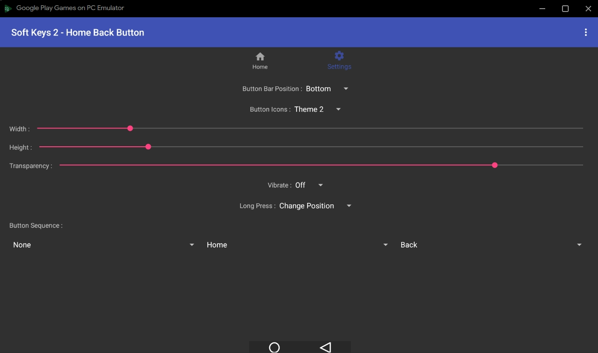

# Screenshot

Tested on: 
- Google Play Games on PC Developer Emulator (GPGPCDE): [26.2.961.1](https://github.com/sekedus/omaha/blob/c7c6f7d684c38ec0a07abe1b90cdd9c0847d1f8c/data.json#L333) (Stable)
- Magisk: [30.7](https://github.com/topjohnwu/Magisk/releases/tag/v30.7)

ㅤ
<details>
<summary>List of applications installed by the user (third party applications) along with their version names using ADB.</summary>
ㅤ

Run:
```sh
adb shell "for pkg in \$(pm list packages -3 | cut -f 2 -d ':'); do echo -n \"\$pkg \"; dumpsys package \$pkg | grep versionName | head -n 1 | sed 's/ *versionName=//'; done"
```

```sh
com.xayah.databackup.foss 2.0.12
com.aurora.store 4.8.1
com.dergoogler.mmrl v34296-release
org.fossify.gallery 1.2.1
com.topjohnwu.magisk 30.7
ru.zdevs.zarchiver 1.0.10
com.termux 0.118.3
com.dogusumit.softkeys2 2.0
ru.andr7e.deviceinfohw 5.25.0
mark.via.gp 7.0.0
com.livezen.retroshooting.free 3.3.8
rk.android.app.shortcutmaker 4.2.4
io.github.muntashirakon.AppManager 4.0.5
com.socialnmobile.dictapps.notepad.color.note 4.8.2
dev.ukanth.ufirewall 3.6.1
org.adaway 6.1.4
com.amaze.filemanager 3.10
com.tafayor.killall 1.57.5
app.lawnchair 14.Beta 3
com.anu.developers3k.rootchecker 1.9.0
```
</details>

ㅤ




















